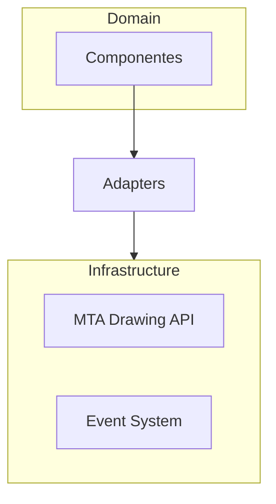

# 🏛️ ADR-001: Diseño de Arquitectura para ReanUI

## 1. Contexto y Problema
El objetivo es construir una librería de UI para MTA:SA en Lua, enfocada en la modularidad y el estilo declarativo (tipo CSS). Se requiere una estructura que permita escalar sin ensuciar la lógica de renderizado ni la gestión de eventos.

## 2. Casos de Uso Principales
- **CU-01**: Definir estilos de componentes mediante DSL Lua-CSS.
- **CU-02**: Renderizar componentes en el ciclo `onClientRender` de MTA.
- **CU-03**: Gestionar eventos de interacción (click, hover).

## 3. Estructura de Directorios
```text
src/
  domain/          # Lógica pura, sin dependencias de MTA
  adapters/        # Transformación de datos (CSS -> Primitivas)
  infrastructure/  # Implementaciones específicas de MTA (dxDraw, eventos)
  theme/           # Definición de tokens de diseño
```

## 4. Diagrama de Arquitectura


## 5. Decisiones Técnicas
- **DSL**: Uso de tablas configurables con metatables para simular CSS.
- **Renderizado**: Patrón bridge para aislar `dxDraw`.

## 6. Consecuencias
- ✅ **Positivas**: Total desacoplamiento de la lógica de renderizado.
- ⚠️ **Negativas**: Necesidad de un gestor de estilos eficiente.
